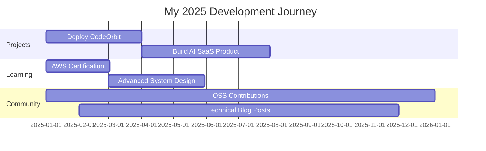

<div align="center">
  
</div>

<h2 align="center">
  
</h2>

<p align="center">
  <a href="mailto:sskadam6305@gmail.com">
    
  </a>
  <a href="https://linkedin.com/in/sameerkadam">
    
  </a>
  <a href="https://leetcode.com/Sameer6305/">
    
  </a>
  <a href="https://www.codechef.com/users/Sameer6305">
    
  </a>
  <a href="https://github.com/Sameer6305">
    
  </a>
</p>

<p align="center">
  
  
</p>

---


## 🚀 About Me

```javascript
const sameer = {
    location: "Pune, India 📍",
    education: "B.E. Electronics & Telecom (Final Year) 🎓",
    role: "Full Stack Developer & AI/ML Engineer",
    currentFocus: [
        "TypeScript", 
        "React Ecosystem", 
        "AWS Cloud", 
        "System Design"
    ],
    workingOn: "CodeOrbit - Real-time Collaborative Coding Platform 🚀",
    communities: [
        "Open Source Contributor 👨‍💻", 
        "Hackathon Finalist 🏆"
    ],
    lifePhilosophy: "Build. Learn. Ship. Repeat. 🔁",
    askMeAbout: ["Web Dev", "AI/ML", "DSA", "Cloud"],
    funFact: "I debug with console.log() and I'm not ashamed! 😄"
};

console.log(sameer);
```

<br clear="right"/>

<div align="center">
  
### 💡 **What Drives Me**
  
> *"Turning innovative ideas into scalable, real-world solutions through clean code, cutting-edge tech, and collaborative teamwork."*

</div>

---

## 🔥 Current Focus

<table>
<tr>
<td width="50%" valign="top">

### 🎯 Active Projects

```yaml
project: CodeOrbit
status: In Development
features:
  - Real-time collaboration
  - Live code sharing
  - Team workspaces
  - Socket.io integration
  - AI code suggestions
technologies:
  - React & Node.js
  - MongoDB & Express
  - Socket.io & WebRTC
```

</td>
<td width="50%" valign="top">

### 📚 Learning Journey

```yaml
current_learning:
  - Advanced TypeScript patterns
  - AWS cloud architecture
  - System design principles
  - Microservices architecture
  
goals_2024:
  - Master AWS certifications
  - Contribute to major OSS
  - Build production apps
  - Win hackathons 🏆
```

</td>
</tr>
</table>

---

## 💼 Featured Projects

<div align="center">

| 🎯 Project | 📝 Description | 🛠️ Tech Stack | 🔗 Links |
|:-----------|:---------------|:--------------|:---------|
| **🌐 CodeOrbit** | Real-time collaborative coding platform with live chat, team management, and project tracking | `React` `Node.js` `Express` `MongoDB` `Socket.io` | [](https://github.com/Sameer6305/codeorbit) |
| **🎪 Hackerzz Lobby** | Complete event management system for hackathons with registration, team formation, and dashboards | `React` `Python` `JavaScript` | [](https://github.com/Sameer6305) |
| **🎨 AuroraAI** | AI-powered personalized wallpaper generator based on mood, time, and user activity | `TypeScript` `Supabase` `AI/ML` | [](https://github.com/Sameer6305) |
| **📊 Algorithm Visualizer** | Interactive visualization tool for sorting and searching algorithms with step-by-step execution | `JavaScript` `Canvas API` `CSS3` | [](https://github.com/Sameer6305) |
| **💻 DSA Visualizer** | Visual representation of complex data structures with real-time animations | `JavaScript` `D3.js` `SVG` | [](https://github.com/Sameer6305) |
| **🌟 Portfolio Website** | Personal portfolio showcasing projects, skills, and professional journey | `HTML` `CSS` `JavaScript` | [](https://github.com/Sameer6305) |

</div>

<div align="center">
  <a href="https://github.com/Sameer6305?tab=repositories">
    
  </a>
</div>

---

## 🛠️ Tech Arsenal

<div align="center">

### 💻 Languages


### 🎨 Frontend


### ⚙️ Backend & Database


### ☁️ DevOps & Cloud


### 🤖 AI/ML & Data Science


</div>

---

## 📊 GitHub Analytics

<p align="center">
  
  
</p>

<p align="center">
  
</p>

<p align="center">
  
</p>

---

## 🏆 Achievements & Trophies

<p align="center">
  
</p>

<div align="center">

| 🎯 Achievement | 📝 Description |
|:--------------|:---------------|
| 🥈 **Hackathon Finalist** | Built innovative solutions under pressure and time constraints |
| 🌟 **Open Source Contributor** | Active contributor to community projects and repositories |
| 💻 **500+ Problems Solved** | Consistent problem-solver on LeetCode & CodeChef |
| 🎓 **Continuous Learner** | Always exploring cutting-edge technologies and frameworks |
| 🚀 **Project Leader** | Led multiple team projects with successful deployment |

</div>

---

## 💭 Development Philosophy

<div align="center">

### 🔄 **The Developer's Loop**

</div>

```javascript
while (alive) {
    eat();
    code();
    sleep();
    repeat();
}

// Bonus: Coffee-driven development ☕
function developSoftware() {
    while (coffee.available()) {
        code();
        debug();
        if (works) {
            celebrate();
        }
        coffee.refill();
    }
}
```

<br/>

<div align="center">

| 🎯 **Quality Over Quantity** | 🤝 **Collaboration First** | 🚀 **Ship Fast, Learn Faster** |
|:----------------------------:|:---------------------------:|:-------------------------------:|
| Writing clean, maintainable<br/>code that scales | Building together is<br/>better than building alone | Iterate quickly,<br/>improve continuously |

</div>

<br/>

<div align="center">

```diff
+ Write code that others (and future you) will thank you for
+ Embrace feedback as a gift for continuous improvement
+ Focus on solving real problems, not just writing code
+ Test early, test often, deploy with confidence
```

</div>

---

## 🎯 2025 Goals & Roadmap

<div align="center">



</div>

<table align="center">
<tr>
<td width="33%" align="center">

### 🚀 **Projects**
- [ ] Deploy CodeOrbit to production
- [ ] Reach 1000+ active users
- [ ] Launch 2 SaaS products
- [ ] Build AI-powered tools

</td>
<td width="33%" align="center">

### 📚 **Learning**
- [ ] AWS Solutions Architect
- [ ] Master System Design
- [ ] Advanced TypeScript
- [ ] Cloud Native Development

</td>
<td width="33%" align="center">

### 🤝 **Community**
- [ ] 50+ OSS contributions
- [ ] 20+ technical blogs
- [ ] Win major hackathons
- [ ] Mentor 10+ developers

</td>
</tr>
</table>

---

## 🤝 Let's Connect & Collaborate

<div align="center">


<br/><br/>

### 💬 **I'm always excited to collaborate on innovative projects!**

<br/>

**Open to:**

🔹 Full-time opportunities  
🔹 Freelance projects  
🔹 Open source collaborations  
🔹 Innovative startup ideas  
🔹 Knowledge sharing & mentorship  

<br/>

[](https://linkedin.com/in/sameerkadam)
[](mailto:sskadam6305@gmail.com)
[](https://leetcode.com/Sameer6305/)
[](https://www.codechef.com/users/Sameer6305)
[](https://github.com/Sameer6305)

<br/>

### 💡 **"Got an idea? Let's turn it into reality!"**

<br/>


</div>

---

<div align="center">
  
### 🐍 **Contribution Snake**

<picture>
  <source media="(prefers-color-scheme: dark)" srcset="https://raw.githubusercontent.com/Sameer6305/Sameer6305/output/github-contribution-grid-snake-dark.svg">
  <source media="(prefers-color-scheme: light)" srcset="https://raw.githubusercontent.com/Sameer6305/Sameer6305/output/github-contribution-grid-snake.svg">
  
</picture>

</div>

---

<div align="center">
  
</div>

<div align="center">
  
**⭐ From [Sameer6305](https://github.com/Sameer6305) | Last Updated: November 2024**

*If you find my work interesting, feel free to star my repositories!*

<br/>


</div>
