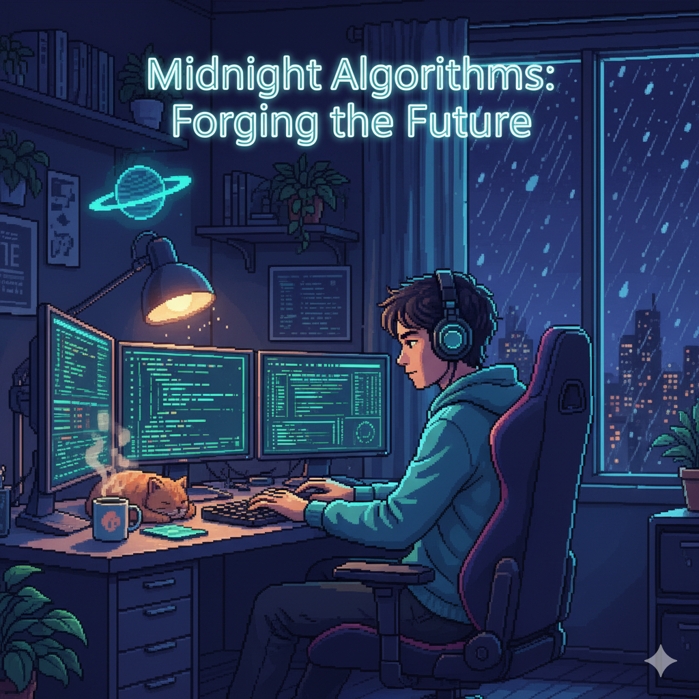
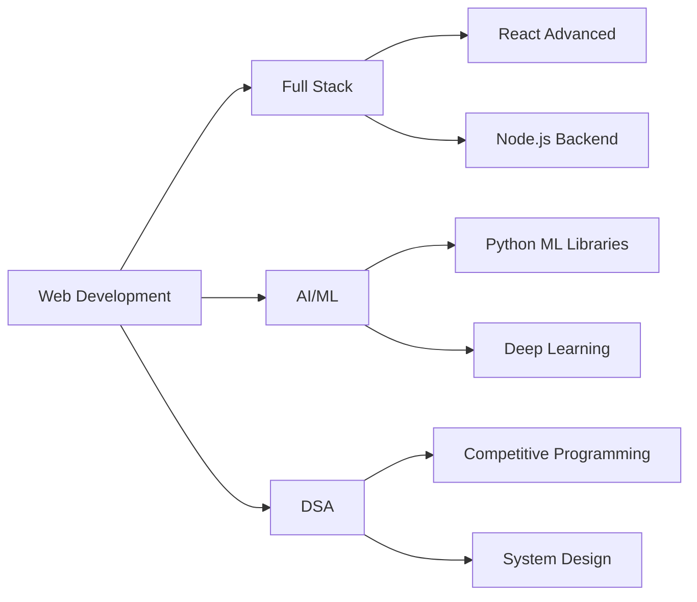

<div align="center">
  
</div>

<h1 align="center">
  
</h1>

<p align="center">
  <em>Ambitious College Student | Aspiring Software Developer | Tech Enthusiast</em>
</p>

<p align="center">
  <a href="mailto:sskadam6305@gmail.com">
    
  </a>
  <a href="https://github.com/Sameer6305">
    
  </a>
  <a href="https://linkedin.com/in/sameerkadam">
    
  </a>
</p>

<p align="center">
  
  
</p>

---

## 👨‍💻 About Me

```text
📍 Location: Pune, India
🎓 Education: B.E. in Electronics & Telecommunication Engineering
📅 GitHub Journey: Started May 2024
💼 Status: Open to Internships & Collaborations
🎯 Goal: Building impactful solutions through code
```

> *"I'm a passionate college student exploring the world of technology one project at a time. My GitHub is a reflection of my learning journey — from academic projects and personal experiments to open-source contributions. I love turning ideas into code and building things that make a real impact."*

### 🌟 What I'm Up To

- 🔭 Currently working on **Full-Stack Web Applications**
- 🌱 Learning **Advanced React Patterns, System Design & Cloud Technologies**
- 👯 Looking to collaborate on **Open Source Projects & Hackathons**
- 💬 Ask me about **Web Development, DSA, Python, JavaScript**
- ⚡ Fun fact: **I turn caffeine into code ☕💻**

---

## 🛠️ Technical Skills

<div align="center">

### Languages


### Frontend Development


### Backend Development


### Databases & Backend Services


### Tools & Platforms


</div>

---

## 🚀 Featured Projects

<div align="center">

| 🎯 Project | 📝 Description | 💻 Tech Stack | 🔗 Link |
|------------|---------------|---------------|---------|
| **Portfolio Website** | A responsive personal portfolio showcasing skills, projects, and achievements with modern UI/UX design | `HTML` `CSS` `JavaScript` | [View →](https://github.com/Sameer6305/portfolio-website) |
| **Hackerzz Lobby** | Comprehensive hackathon management platform featuring event creation, team registration, and dynamic dashboards | `React` `Python` `JavaScript` | [View →](https://github.com/Sameer6305/hackerzz-lobby) |
| **AuroraAI** | AI-powered application generating personalized daily wallpapers based on user moods, activities, and preferences | `TypeScript` `Supabase` `AI/ML` | [View →](https://github.com/Sameer6305/auroraai) |
| **Algorithm Visualizer** | Interactive educational tool for visualizing sorting and searching algorithms with step-by-step animations | `HTML` `CSS` `JavaScript` | [View →](https://github.com/Sameer6305/algorithm-visualizer) |

</div>

<p align="center">
  <a href="https://github.com/Sameer6305?tab=repositories">
    
  </a>
</p>

---

## 📊 GitHub Analytics

<div align="center">
  
  
</div>

<div align="center">
  
</div>

<div align="center">
  
</div>

---

## 🏆 Achievements & Milestones

<div align="center">

| 🎯 Achievement | 📅 Status |
|----------------|-----------|
| 💻 Active GitHub Contributor | ✅ Since May 2024 |
| 🏅 Hackathon Participant | ✅ University Level |
| 🤝 Team Collaboration Projects | ✅ Multiple Projects |
| 📚 Continuous Learning | ✅ Ongoing |
| 🌟 Open Source Contributions | ✅ Growing |

</div>

---

## 📈 Contribution Activity

<div align="center">
  
[](https://github.com/Sameer6305)

</div>

---

## 💡 Current Learning Path

<div align="center">



</div>

---

## 🎯 2024-2025 Goals

<div align="center">

| Goal | Progress |
|------|----------|
| 📚 Master Full-Stack Development | ████████░░ 80% |
| 🤖 Build 3 AI/ML Projects | ██████░░░░ 60% |
| 🏆 Participate in 5+ Hackathons | ████░░░░░░ 40% |
| 💼 Secure Software Internship | ████░░░░░░ 40% |
| ⭐ Contribute to 10 Open Source Projects | ██░░░░░░░░ 20% |
| 📝 Write 12 Technical Blogs | ██░░░░░░░░ 20% |

</div>

---

## 🎨 Coding Stats

<div align="center">

<!--START_SECTION:waka-->
```text
JavaScript   8 hrs 15 mins   ████████████░░░░░   48.2%
Python       4 hrs 30 mins   ██████░░░░░░░░░░░   26.3%
TypeScript   2 hrs 45 mins   ████░░░░░░░░░░░░░   16.1%
CSS          1 hr 20 mins    ██░░░░░░░░░░░░░░░    7.8%
HTML         0 hrs 30 mins   ░░░░░░░░░░░░░░░░░    2.9%
```
<!--END_SECTION:waka-->

</div>

---

## 💭 Developer Quote

<div align="center">


</div>

---

## 🤝 Let's Connect & Collaborate!

<div align="center">

### I'm actively seeking opportunities in:

🔹 **Software Development Internships**  
🔹 **Open Source Contributions**  
🔹 **Hackathon Teams**  
🔹 **Collaborative Projects**  
🔹 **Tech Community Engagement**

### 📬 Reach Out To Me:

<a href="mailto:sskadam6305@gmail.com">
  
</a>
<a href="https://linkedin.com/in/sameerkadam">
  
</a>
<a href="https://twitter.com/sameerkadam">
  
</a>
<a href="https://github.com/Sameer6305">
  
</a>

### ⚡ Quick Response Time: Usually within 24 hours!

</div>

---

## 🌟 Support My Work

<div align="center">

If you find my projects helpful or interesting, consider:

⭐ **Starring my repositories**  
🍴 **Forking and contributing**  
💬 **Sharing feedback and suggestions**  
🤝 **Collaborating on new ideas**

<a href="https://www.buymeacoffee.com/sameerkadam">
  
</a>

</div>

---

<div align="center">

### 🎯 "Code is like humor. When you have to explain it, it's bad." – Cory House


**Made with ❤️ and ☕ by Sameer Kadam**

*Last Updated: October 31, 2024*

<p>
  
</p>

</div>
