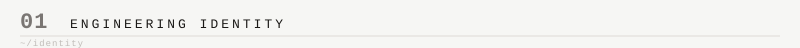
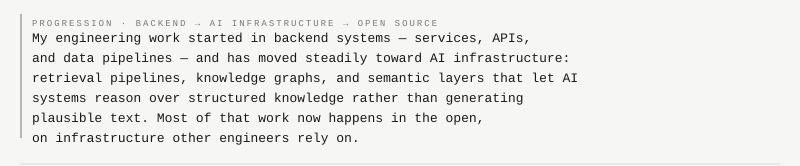
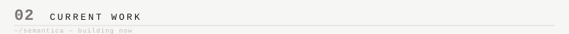
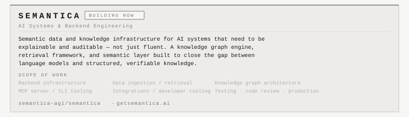
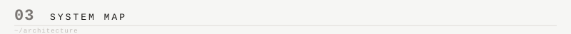
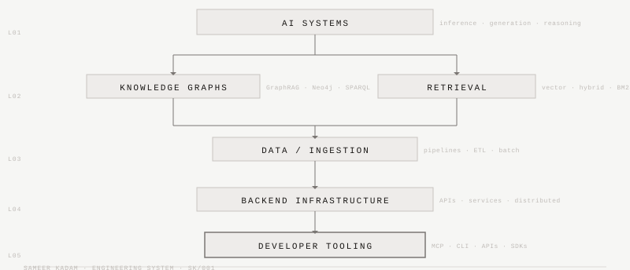
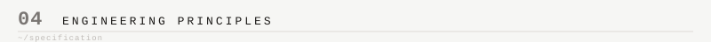
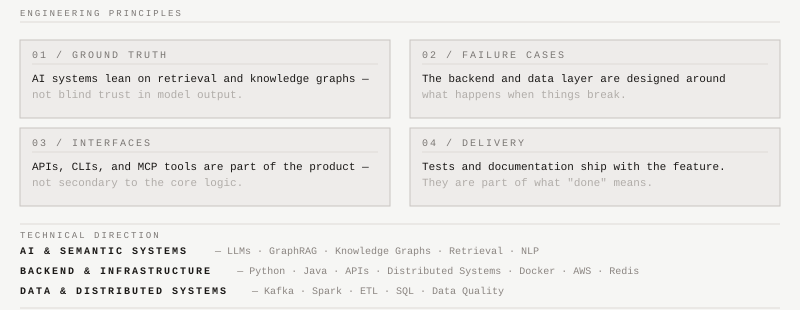
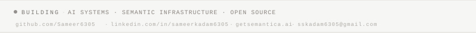

[GitHub](https://github.com/Sameer6305) · [LinkedIn](https://www.linkedin.com/in/sameerkadam6305/) · [Semantica](https://getsemantica.ai/) · [sskadam6305@gmail.com](mailto:sskadam6305@gmail.com)

<picture>
  <source media="(prefers-color-scheme: dark)"  srcset="assets/dark/s01.svg"/>
  
</picture>

<picture>
  <source media="(prefers-color-scheme: dark)"  srcset="assets/dark/identity.svg"/>
  
</picture>

<picture>
  <source media="(prefers-color-scheme: dark)"  srcset="assets/dark/s02.svg"/>
  
</picture>

<picture>
  <source media="(prefers-color-scheme: dark)"  srcset="assets/dark/semantica.svg"/>
  
</picture>

<picture>
  <source media="(prefers-color-scheme: dark)"  srcset="assets/dark/s03.svg"/>
  
</picture>

<picture>
  <source media="(prefers-color-scheme: dark)"  srcset="assets/dark/system-map.svg"/>
  
</picture>

<picture>
  <source media="(prefers-color-scheme: dark)"  srcset="assets/dark/s04.svg"/>
  
</picture>

<picture>
  <source media="(prefers-color-scheme: dark)"  srcset="assets/dark/principles.svg"/>
  
</picture>

<picture>
  <source media="(prefers-color-scheme: dark)"  srcset="assets/dark/footer.svg"/>
  
</picture>
